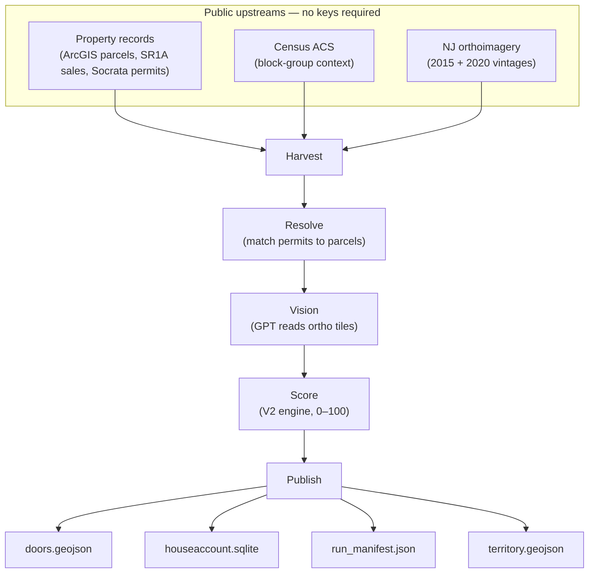
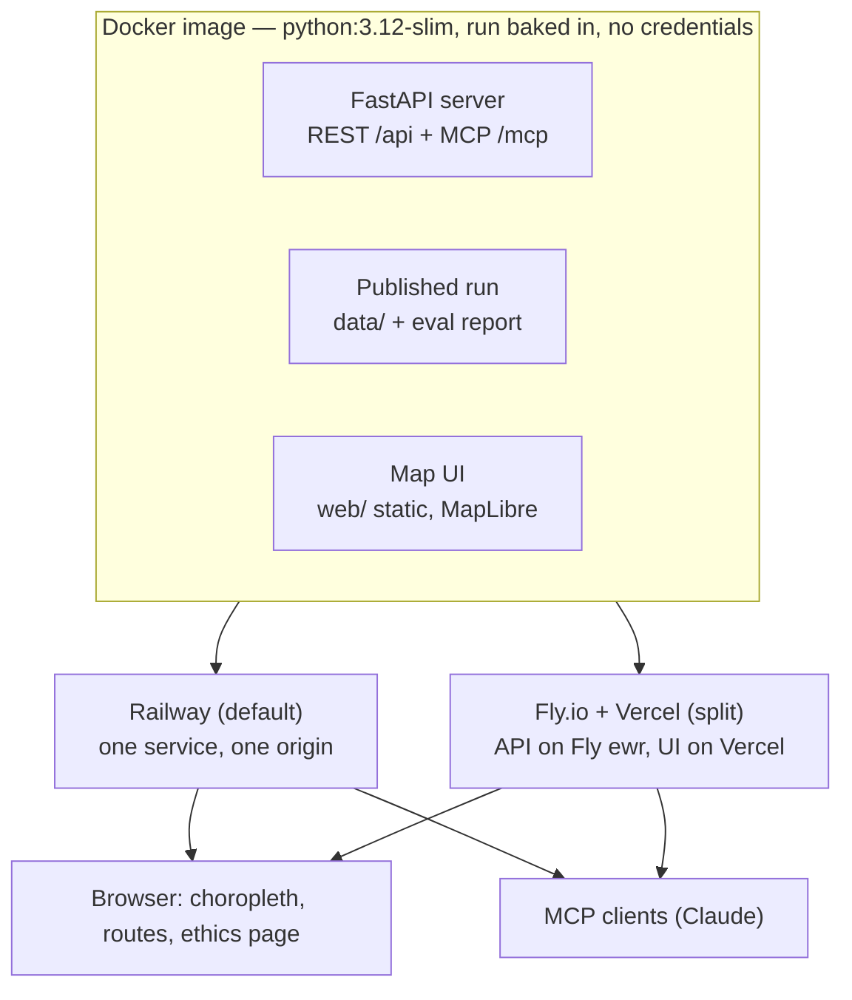
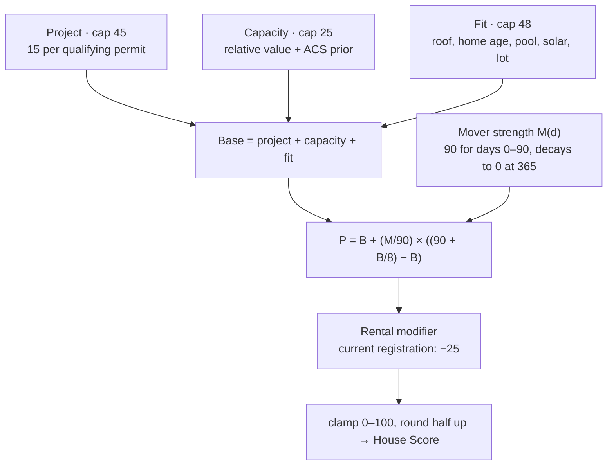

# Architecture

How HouseAccount is put together: the pipeline that produces a run, the
artifacts a run publishes, the server and UI that read them, and where it all
deploys. Companion to [`DEPLOY.md`](DEPLOY.md) (the deployment runbook) and the
V2 scoring plan in
[`plans/2026-08-18-2221-feat-door-score-v2-plan.md`](plans/2026-08-18-2221-feat-door-score-v2-plan.md)
(the scoring contract). Where this file and those disagree, those win.

## The pipeline

`make pipeline` runs five stages in order — harvest → resolve → vision →
score → publish — against live public APIs, roughly twelve seconds end to end
([`src/houseaccount/pipeline.py`](../src/houseaccount/pipeline.py)).

- **Harvest** ([`sources/`](../src/houseaccount/sources/)) — parcels + MOD-IV
  assessments (ArcGIS), SR1A sales register, Socrata construction permits,
  Census ACS block groups, TIGER streets, rental registry. Only the parcel
  harvest is load-bearing: a `SourceError` there aborts the run; every other
  failure becomes a named entry in the manifest's `degradations[]` and the run
  still publishes every door. Responses are cached under `cache/`.
- **Resolve** ([`resolve.py`](../src/houseaccount/resolve.py)) — entity
  resolution joining permit records to parcels; the municipal match rate is an
  eval gate (≥ 0.95).
- **Vision** ([`vision/`](../src/houseaccount/vision/)) — fetches
  public-domain NJ ortho tiles and asks an OpenAI vision model for pool /
  solar / exterior-condition observations. Declines cleanly with no
  `OPENAI_API_KEY`, before fetching a single tile.
- **Score** ([`scoring/v2.py`](../src/houseaccount/scoring/v2.py)) — pure
  function, no I/O; see [Scoring engine](#the-scoring-engine-v2) below.
- **Publish** ([`publish.py`](../src/houseaccount/publish.py)) — writes the
  four artifacts into `data/`. Everything downstream (server, map, eval) reads
  these and re-derives nothing.

## Serving and deployment

One FastAPI process (`houseaccount.server.app:create_app`) reads the published
run once at boot — missing artifacts fail the boot with `DataUnavailable` —
and answers on two front doors:

- **REST** — `GET /api/doors.geojson`, `GET /api/door/{pams_pin}`,
  `POST /api/route`, `GET /health`.
- **MCP** at `/mcp` — `get_door_score`, `explain_score`, `plan_route`.

Both topologies ship from the same [`Dockerfile`](../Dockerfile), which bakes
`data/` into the image — a deploy is an immutable copy of a reviewed run, with
nothing stateful to lose. The server holds no credentials and makes no
outbound calls. `/health` reports the door count, so "up but serving an empty
territory" fails the deploy gate. Full runbook: [`DEPLOY.md`](DEPLOY.md).

## The scoring engine (V2)

`score_door_v2(bundle, as_of)` in
[`scoring/v2.py`](../src/houseaccount/scoring/v2.py) is pure — no I/O, no
network — and its output envelope is pinned byte-for-byte by the golden
fixtures in [`eval/v2/golden/`](../eval/v2/golden/), which are the spec.

Three additive categories build the base:

| Category | Cap | Signals |
|---|---|---|
| Project | 45 | 15 points per distinct qualifying permit — active now (non-terminal, lifecycle event within 12 months) or completed within 24 months. Three permits saturate. |
| Capacity | 25 | Assessed value vs the nearest-20 comparable median (3/7/10 at >1.0×/≥1.2×/≥1.5×); territory percentile (3/7/10 at ≥50th/≥75th/≥90th); +5 ACS dual-income prior (≥35% of block group). |
| Fit | 48 | Roof age from completed install permits (4/8/12 at ≥10/≥15/≥20 yrs); home age (5/8/10 at ≥30/≥50/≥75 yrs); verified exterior-condition decline +8 (unless superseded by a later exterior permit); pool +8; solar +5; lot ≥0.5 acre +5. |

Then two adjustments:

- **Mover** — a recent market sale is the strongest signal. Strength is 90 for
  the first 90 days, then a normalized exponential decay to 0 at day 365.
  It *blends* rather than adds: `P = B + (M/90) × ((90 + B/8) − B)`, so a
  fresh mover lifts any door toward the 90s while still preserving base-score
  ordering. Nominal prices (≤ $100), disqualifying sales codes, and future
  dates are excluded.
- **Rental** — a current rental registration demotes the door −25; a stale one
  is recorded but neutral; a missing registry is a named data gap.

Every point earned or denied appends an evidence entry (type, points,
doorstep-ready reason, source attribution, retrieval date) — the map panel and
`explain_score` render these verbatim. Missing inputs append `data_gaps[]`
instead of guesses; two or more gaps drop `confidence` to `low`. The final
score is clamped to 0–100 and rounded half-up.

## Tech stack

| Layer | Tech |
|---|---|
| Pipeline | Python 3.12, `requests`, `shapely` (deliberately not GeoPandas), Pillow; disk cache in `cache/` |
| Vision | OpenAI SDK reading NJ public-domain ortho tiles |
| Scoring | Pure-Python V2 engine, pinned by golden fixtures in `eval/v2/` |
| Storage | SQLite + GeoJSON files — no database server |
| API | FastAPI + uvicorn (`create_app` factory); MCP via the `mcp` SDK |
| Frontend | Vanilla ES modules + MapLibre, no build step, no npm dependencies; DOM-free logic modules unit-tested with `node --test` |
| Tests | pytest + `node --test`; `make eval` reproduces the golden fixtures as a gate |
| Tooling | `uv`, `make`, Docker (Railway / Fly.io + Vercel) |
