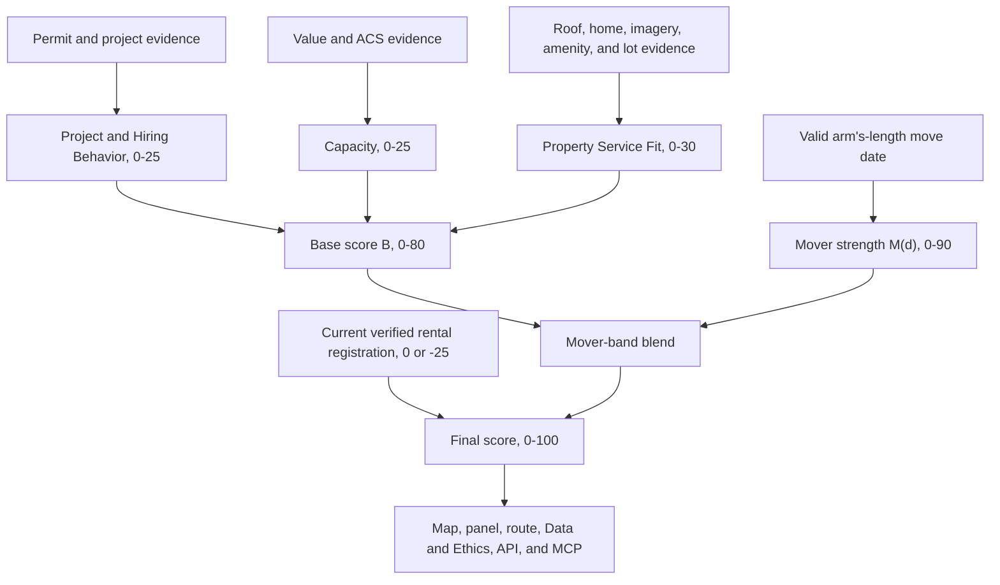

# Door Score V2 - Plan

## Goal Capsule

- **Objective:** Every territory property has a current, evidence-backed 0-100 score that ranks how receptive its household is likely to be to a HouseAccount field representative and home-services concierge.
- **Means:** Replace the current additive scoring contract with a mover-dominant blend informed by municipal project history, relative property value, service-fit signals, and verified rental registration.
- **Product authority:** This contract governs Door Score V2 behavior and the repository-wide migration from the current scoring algorithm. It supersedes the scoring requirements in `docs/PRD.md` when implementation begins; the rest of that product PRD remains authoritative.
- **Naming:** “Door Score V2” and “House Score V2” refer to the same score. Renaming the surfaced House Score product is not required.
- **Open blockers:** None. Missing rental, imagery, roof, or SDL property data has defined neutral behavior and does not block planning.

---

## Product Contract

### Summary

Door Score V2 will give field representatives a deterministic, explainable ranking in which a recent move is the strongest signal. Project behavior, capacity, and property service fit distinguish houses within and outside the mover window, while a current verified rental registration demotes households that are less likely to control major home-service decisions.

### Problem Frame

The current score adds five groups and clamps the result to 100. That structure produces ties among high-signal doors, drops the mover signal to zero after 90 days, and gives a single broad home-age rule to 511 of the 540 territory properties.

Some current signals also overstate what the data proves. Provider churn cannot fire from the ingested permit sources: no SDL roof detail displayed a contractor entry, and neither snapshot provides reliable contractor identity (see Dependencies). A lack of permits is not evidence of deferred maintenance. A permit status of `Open` is not enough to prove current activity: 617 of the 3,662 coalesced SDL history records carry a non-terminal `Open` status, some decades old.

The 2026-08-18 SDL snapshot adds useful municipal evidence but remains incomplete and point-in-time. It contains 532 collected property pages, 3,662 coalesced permit records, and 210 roof-detail enrichments for the 540-property territory. Eight SDL property pages were unavailable, pre-2002 roof-search coverage is incomplete, and no SDL roof detail displayed a contractor entry.

### Key Decisions

- **Blend movers into a priority band.** (session-settled: user-approved — chosen over simple addition and a hard mover floor: base evidence can distinguish recent movers without weakening their priority.) Governs R2, R4, R5.
- **Use exponential mover decay.** (session-settled: user-directed — chosen over linear decay: mover intent should fall quickly after the first 90 days and taper to zero at one year.) Governs R4.
- **Separate roof need from project behavior.** (session-settled: user-directed — chosen over rewarding every new roof as property need: replacement removes the old-roof need but still shows willingness to undertake work.) Governs R9-R11, R17.
- **Use conservative municipal evidence.** (session-settled: user-approved — chosen over broad keyword and status inference: unknown or ambiguous records remain neutral.) Governs R8-R12, R17, R23.
- **Use both local and territory-wide capacity.** (session-settled: user-approved — chosen over either comparison alone: immediate neighbors create local distinction while polygon percentile preserves absolute territory position.) Governs R13-R16.
- **Apply a stronger verified-rental demotion.** (session-settled: user-directed — chosen over the current -15 modifier: a registered rental is less likely to contain the decision-maker for substantial work.) Governs R6.
- **Keep door-level confidence with a gap-count rule.** (session-settled: user-approved 2026-08-18 spec-review — chosen over dropping the published field: `confidence` is `low` when a door carries 2 or more typed data gaps, otherwise `normal`.) Governs R37.
- **Keep scores 0-100 and restop the map ramp.** (session-settled: user-approved 2026-08-18 spec-review — chosen over reopening the blend: on current data ~538 of 540 doors sit in 0-80, so the ramp/legend recalibrates to the V2 distribution while the scoring contract is untouched.) Governs R38.
- **Unknown roof age stays neutral.** (session-settled: user-approved 2026-08-18 spec-review — chosen over a partial prior: ~135 of 540 doors (25%) have a closed explicit roof-install record; inference for the rest would violate the R22 roof row.) Confirms R17/R22.
- **Replace the old contract across the product.** (session-settled: user-directed — chosen over treating documentation cleanup as optional: implementing agents need one current scoring authority.) Governs R27-R33.

### Actors

- A1. **Field representative:** Uses the ranked map, score explanation, and talk track to decide which doors to approach.
- A2. **Product operator:** Refreshes inputs, publishes scores, audits data gaps, and evaluates field outcomes.
- A3. **Scoring system:** Resolves property evidence, calculates the score as of a declared date, and emits a complete evidence trail.

### Score Architecture



### Requirements

**Score output and mover dominance**

- R1. Door Score V2 must return one deterministic integer from 0 through 100 for every territory property, using the same result whenever the evidence and `as_of` date are unchanged. The product continues to surface a number rather than a letter grade or score tier.
- R2. The base score `B` must equal Project and Hiring Behavior, capped at 25, plus Capacity, capped at 25, plus Property Service Fit, capped at 30. Therefore `B` ranges from 0 through 80.
- R3. Mover eligibility must use the freshest valid arm's-length property transfer available as of the run date. A transfer with sale price at or below $100, a nonempty disqualifying sales code, an invalid date, or a future date receives no mover influence. A disqualified transfer neither earns mover influence nor prevents an older valid transfer from being the freshest valid one, and R6 staleness comparisons use valid transfers only. Upstream deed-date normalization, including the YYMMDD century pivot of PRD R6.0, remains in force before scoring.
- R4. Mover strength `M(d)` must be 90 for days 0 through 90 after the effective move date, follow the normalized exponential below for days 91 through 364, and equal 0 on day 365 and afterward. `d` is the calendar-day difference between `as_of` and the effective move date, and intermediate values are not rounded. All ages and temporal windows across R4, R9-R11, R17, and R18 are whole elapsed calendar days or years from the effective evidence date to `as_of`, truncated, never rounded up.

```text
t = (d - 90) / 275
M(d) = 90 * (exp(-2t) - exp(-2)) / (1 - exp(-2))
```

  The 275-day denominator is derived, not tunable: it is 365 − 90, the span between the flat band's end and the one-year zero. The −2 coefficient is a provisional shape constant chosen for fast early falloff; it is subtracted-and-normalized so M is exactly 0 at day 365, and revisiting it is explicitly deferred until field outcomes exist (see Deferred beyond V2).

- R5. Before the rental modifier, the score must blend `B` toward the mover priority band using `P = B + (M(d) / 90) * ((90 + B / 8) - B)`. The divisor 8 is derived, not tunable: it maps the base range 0-80 (R2) onto the 10-point priority band, so the full-strength mover target `90 + B/8` runs from 90 (B = 0) to 100 (B = 80). This gives a qualifying 0-90-day mover a pre-rental score from 90 through 100 while preserving base-score differentiation. If the R2 caps ever change, the divisor is `B_max / 10`, not 8.
- R6. A current verified municipal rental-registration match must apply -25 after the mover blend, including for a recent mover. The registration is current when it is dated on or after the latest valid arm's-length sale, or - when no valid sale exists - when it is dated within the 24 months preceding `as_of` (a provisional currency window, to be retuned with field data); an older registration is stale and neutral until reverified, and missing rental data is neutral with a data-gap explanation. Until a verified municipal list is supplied, the -25 path ships dormant and is exercised only by fixtures.
- R7. The final score must be `round_half_up(clamp(P + rental_modifier, 0, 100))`. Its explanation must show the three capped base categories, the mover lift `P - B`, the rental modifier, and any rounding or clamp adjustment so displayed arithmetic reconciles to the final integer. When a category's raw signals exceed its cap, the evidence list must include an explicit cap-adjustment entry so evidence points sum to the capped subtotal.

**Project and Hiring Behavior**

- R8. Permit records must be resolved to a territory parcel and coalesced into distinct projects before scoring. Amendments, supplements, and the same municipal record appearing in both statewide and SDL sources count once, with the richer municipal record retained for evidence.
- R9. One or more active qualifying projects must add 15 within the R2 project-category cap. A project is active only when it lacks a terminal disposition and has a qualifying issue, review, inspection, or status event within the preceding 12 months; an old `Open` label by itself is not active evidence.
- R10. One or more completed qualifying projects within the preceding 24 months must add 8 within the R2 project-category cap. Completion requires a terminal completed disposition and a displayed close, certificate, final-inspection, or equivalent lifecycle date; issue date may be a fallback only when the record is explicitly terminal and no later lifecycle date is displayed.
- R11. Two or more distinct qualifying permits issued within the preceding 24 months must add 5, and at least one qualifying major renovation or addition within that period must add another 5, both within the R2 project-category cap. Major work requires an explicit addition, renovation, alteration, or new-construction scope in the record's displayed description; reported cost may corroborate classification but does not earn points by itself, and scopes outside that closed list are not major.
- R12. Voided, abandoned, denied, expired, and administrative-only records, and non-terminal records that fail R9's 12-month activity test, must earn no project points. Permits are a proxy for undertaking home projects, not proof of a hired contractor, so contractor churn and contractor-identity scoring must be removed.

**Capacity**

- R13. Relative value among the up-to-20 geographically closest valid single-family comparables, measured by parcel-centroid distance, must add 0 when the subject is at or below their median, 3 when above 1.0x and below 1.2x, 7 when at least 1.2x and below 1.5x, and 10 when at least 1.5x. With 10 through 19 valid comparables the median is computed from those available; fewer than 10 valid comparables makes this signal neutral and records a data gap.
- R14. Assessed-value percentile among valid single-family properties in the territory polygon must add 0 below the 50th percentile, 3 at or above the 50th and below the 75th, 7 at or above the 75th and below the 90th, and 10 at or above the 90th. Ties must use a deterministic midrank percentile; midrank percentiles are fractional, so the bands are half-open intervals with no holes.
- R15. An ACS block-group dual-income prior at or above 35% must add 5 within the R2 capacity cap. Every explanation must call this a neighborhood-level prior and must not claim that the subject household is dual-income.
- R16. Missing assessed value, insufficient local comparables, missing ACS data, or an unresolved parcel match must add no capacity points for the affected signal and must not prevent other capacity signals from scoring.

**Property Service Fit**

- R17. Roof age must use the latest completed permit that explicitly establishes a full replacement, reroof, or reshingle installation. A known roof younger than 10 years adds 0, age 10-14 adds 4, age 15-19 adds 8, and age 20 or older adds 12; generic `ROOF`, repair, partial, porch, deck, addition, accessory-structure, and solar-only records do not establish installation age, and unknown age is neutral. Completion date is preferred, with issue date allowed only for an explicitly completed qualifying permit that displays no later lifecycle date (the same fallback rule as R10).
- R18. Home age must add 0 below 30 years, 2 from 30 through 49 years, 5 from 50 through 74 years, and 8 at 75 years or older. Missing or invalid construction year is neutral.
- R19. Verified exterior-condition decline from the 2015 to 2020 imagery vintages must add 8 when the underlying structured observations meet the existing 0.60 confidence floor. Missing imagery is neutral, the explanation must describe historical decline rather than current condition, and the signal becomes neutral when a completed permit with an explicit exterior scope (siding, roof, window, facade, paint, or stucco work) has a completion date after the later imagery vintage (2020).
- R20. A pool must add 5 and solar panels must add 5 when established by a completed explicit permit or imagery meeting the 0.60 confidence floor. Each feature scores once regardless of the number of supporting records, and an active installation permit contributes through R9 but does not establish the completed property feature by itself.
- R21. A lot of at least 0.5 acres must add 5 within the R2 property-fit cap. The current deferred-maintenance combination and any bonus based on the absence of permits must be removed.

**Data authority, evidence, and safety**

- R22. The scoring run must apply the following source roles and precedence; a lower-precedence source may fill a gap but must not overwrite a fresher, valid higher-precedence fact.

| Fact | Primary role | Fallback or corroboration |
|---|---|---|
| Parcel identity, assessed value, construction year, lot size | Territory parcel and MOD-IV data | SDL assessed valuation when the parcel match is exact and current |
| Move date | NJ SR1A valid arm's-length sale | Valid MOD-IV transfer; SDL displayed sale may corroborate or fill a gap only when arm's-length eligibility can be established |
| Project lifecycle and description | Coalesced SDL municipal history | Statewide construction permits for records absent from SDL |
| Pool, solar | Completed explicit permits and qualifying imagery | Either source may corroborate the other without double scoring |
| Exterior condition | 2015/2020 imagery observations | A later completed exterior permit supersedes the observation per R19 and never establishes decline |
| Roof installation date | Completed explicit municipal replacement record | No inferred fallback from home age, imagery, insurance assumptions, or keyword-only records |
| Rental status | Municipal rental registration | No occupancy or owner-identity inference |
| Dual-income prior | ACS block group | No household-level fallback |

- R23. The SDL property-history snapshot must be ingested under the R22 precedence roles without treating an unavailable property page, missing row, blank field, or absent keyword match as proof that an event never occurred. The eight unavailable SDL properties remain scoreable from other sources.
- R24. Every temporal window and age calculation must use the run's declared `as_of` date rather than wall-clock time. Each score must retain the source retrieval date and the effective evidence date used for scoring.
- R25. Matching and scoring must continue to exclude owner names, mailing addresses, permit-agent identity, and inferred household composition. Public records may support property and project facts but not personal profiling.
- R26. Every nonzero signal and every consequential neutralization must emit a machine-readable evidence type, awarded points, plain-language reason, source, effective date, retrieval date, and confidence or data-gap state. Evidence must distinguish a permit proxy from a confirmed contractor relationship. Zero-point context evidence (such as long tenure) remains allowed for explanation and is distinct from consequential neutralizations.

**Migration and stale-reference removal**

- R27. Implementation must replace the current scoring contract rather than run V1 and V2 side by side. All 540 territory doors must be recalculated in one versioned run, and published records must identify the score-contract version so mixed-version outputs can be rejected.
- R28. The implementation must regenerate score-bearing and explanatory artifacts, including published door GeoJSON, run metadata, evaluation output, route inputs, and any cached examples. Regenerating any published artifact from its sources with the same `as_of` must reproduce it byte-identically; hand-edited artifacts fail that check. The regenerated run manifest must carry the score-contract version and `as_of` and drop V1 fields (`territory_median_value`, `top_band_days`, `doors_in_top_band`, and the 90-day-cutoff degradation prose), and the SQLite score store's V1 `groups`/`raw_total` columns must be replaced by V2 category fields.
- R29. The live Data & Ethics experience must explain the V2 objective, exact category caps, mover blend, exponential decay, project and roof evidence rules, rental precedence, missing-data behavior, source limitations, and current evaluation claims. It must not retain the old additive formula, old group maxima, provider-churn claim, deferred-maintenance bonus, 90-day cutoff, or -15 rental language. The page must also retain the signal-to-ICP trace table and state the R36 validation plan, per PRD R11.4.
- R30. The map evidence panel, score math, talk tracks, route output, API responses, MCP tool descriptions, and user-facing degradation messages must use the V2 category names and arithmetic. Every surfaced evidence list must reconcile to the displayed score per R7. Talk tracks and per-door route reason chips must be assembled from deterministic templates keyed by evidence type — the chip uses the highest-point evidence entry, ties broken by descending points then ascending evidence type — so their category names, required phrasings (R15, R19), and arithmetic references are testable by template inspection; free-form generation over evidence is not an automated gate and is checked in manual QA. The type-to-angle template map must cover every V2 evidence type, and value-percentile and local-ratio evidence is unspeakable at the door per PRD R7.2.1. Route aggregates (such as average score) must be computed from the displayed V2 scores, and a shared route URL must carry the score-contract version and prompt a refresh on mismatch per R27.
- R31. Canonical documentation and operational guidance, including `README.md`, `docs/PRD.md`, `docs/DEPLOY.md`, `docs/ui-wireframes.html` (a live acceptance authority, not history), architecture descriptions, and implementation handoff material, must describe V2 or point to this contract as the current scoring authority. Stale fixture counts - the "12 at time of writing" in `docs/PRD.md` R5.2 and the counts in `docs/handoff-prompt.md` - must be reconciled with the machine-readable evaluation report (`README.md` and `eval/report.json` already agree at 13).
- R32. Golden fixtures, verification scripts, Python tests, browser tests, and JavaScript fixtures that encode old group names, maxima, mover bands, value bands, lot points, rental penalties, or evidence sentences must be replaced or revised. Tests must cover every boundary and interaction listed in Acceptance Examples.
- R33. Dated review logs, audit findings, and prototype snapshots may retain old facts as history only when they appear on the R35 historical allowlist; allowlist membership is the operative definition of historical status. No active runtime, canonical document, routed UI, test oracle, generated current-run artifact, or agent-facing description may present the V1 contract as current.

**Validation and product learning**

- R34. The implementation must produce a deterministic V2 golden-fixture report and a 540-door recalculation report containing score coverage, category distributions, score distribution, missing-signal counts, source freshness, and the number of records excluded or deduplicated by each conservative rule. The report must also retain the vision-evaluation metrics required by PRD R5.1 (precision/recall on the top signal, hallucination rate, cost per door) and include an automated check that no published artifact contains owner names, mailing addresses, or permit-agent identity fields (R25).
- R35. A repository-wide stale-contract audit must fail validation when an active surface still asserts the V1 formula or deprecated rules. The audit must distinguish true historical references allowed by R33 from active product claims via an explicit, versioned allowlist of historical paths (dated review logs, audit findings, prototype snapshots); any V1 assertion outside the allowlist fails the audit, and adding a path to the allowlist is a reviewed change, not an audit-time judgment call.
- R36. Field validation must treat a receptive or qualified conversation per answered door as the primary outcome, with requested follow-up and booked service as secondary outcomes. The initial success test is directional ranking lift across score bands or quantiles; an absolute conversion target must not be invented before sufficient field outcomes exist. Attempt-time scores retained in the field-outcome dataset are historical records permitted by R33, not published score surfaces; R27's mixed-version rejection applies to published current-run outputs only.
- R37. Door-level `confidence` remains a published field: `low` when the door's envelope carries 2 or more typed data gaps, otherwise `normal`.
- R38. The map ramp and legend must be recalibrated to the V2 score distribution (for example quantile stops from the R34 recalculation report) while scores remain 0-100 integers per R1.

### Key Flows

- F1. Evidence refresh and resolution
  - **Trigger:** A2 starts a score run for an `as_of` date.
  - **Actors:** A2, A3
  - **Steps:** Load the territory and approved source snapshots; normalize facts; resolve them to parcels; coalesce duplicate projects; classify lifecycle, roof, amenity, and data-gap states; preserve provenance.
  - **Outcome:** Each of the 540 parcels has one normalized evidence bundle or explicit per-source gaps.
  - **Covers:** R3, R8, R12, R22-R26.
- F2. Door scoring
  - **Trigger:** A3 receives a normalized evidence bundle.
  - **Actors:** A3
  - **Steps:** Calculate the three capped base categories; calculate mover strength and lift; apply current rental evidence; round and clamp once; emit category and evidence arithmetic.
  - **Outcome:** The door has one reproducible V2 score and explanation.
  - **Covers:** R1-R21, R26.
- F3. Field-representative use
  - **Trigger:** A1 opens a door, route stop, or score explanation.
  - **Actors:** A1, A3
  - **Steps:** Show the current V2 score; show the highest-value supporting and demoting evidence; disclose neighborhood-level and missing-data limitations; generate a talk track consistent with that evidence.
  - **Outcome:** A1 can understand why the door ranks where it does without reading raw municipal records.
  - **Covers:** R7, R15, R24-R26, R29-R30.
- F4. V2 publication and migration
  - **Trigger:** The V2 implementation passes its scoring fixtures.
  - **Actors:** A2, A3
  - **Steps:** Recalculate all doors in one run; regenerate outputs; publish only when all score-bearing surfaces share the V2 version; run the stale-reference audit.
  - **Outcome:** Runtime behavior, generated data, tests, APIs, and documentation expose one current contract.
  - **Covers:** R27-R35.
- F5. Outcome evaluation
  - **Trigger:** Field outcomes are available for scored door attempts.
  - **Actors:** A1, A2
  - **Steps:** Join outcomes to the score version and score at attempt time; calculate primary and secondary rates by score band or quantile; review ranking lift and signal coverage without retuning from anecdotes.
  - **Outcome:** A2 can judge whether higher scores correspond to greater receptivity and identify later calibration work.
  - **Covers:** R27, R34, R36.

### Acceptance Examples

- AE1. **Fresh mover with no base evidence. Covers R1-R5, R7.** Given a valid arm's-length move 47 days ago, `B = 0`, and no rental match, `M = 90`, `P = 90`, and the final score is 90.
- AE2. **Fresh mover with a strong base. Covers R2, R4, R5, R7.** Given the same 47-day move and `B = 40`, the priority-band target is 95 and the final score is 95 rather than tying every recent mover at 90 or clamping an additive result to 100.
- AE3. **Exponential decay. Covers R4, R5, R7.** Given a valid move 180 days ago and `B = 40`, mover strength is approximately 40.005, the blended pre-rental score is approximately 64.447, and the final score is 64.
- AE4. **Mover cutoff. Covers R4, R5, R7.** Given a valid move 365 days ago and `B = 40`, mover strength is 0 and the final score remains 40.
- AE5. **Rental evidence precedence. Covers R3, R6, R7.** A fresh mover with `B = 40` scores 70 when a rental registration dated after the sale is verified; the same older registration is neutral when a later valid arm's-length sale has not been re-registered.
- AE6. **New roof separates project behavior from need. Covers R10, R17.** An explicitly completed full replacement 18 months ago earns 0 roof-age points and earns the completed-project contribution of 8; an explicitly completed replacement 20 years ago earns 12 roof-age points but no recent-project contribution.
- AE7. **Active versus stale-open roof work. Covers R9, R12, R17.** An unresolved roof-replacement permit with qualifying activity two months ago earns 15 project points and no installed-roof-age points; an `Open` roof record issued in 2004 with no recent lifecycle event earns neither.
- AE8. **Hybrid capacity. Covers R13-R16.** A house assessed at 1.3 times the median of its 20 closest comparables, at the 85th territory percentile (midrank), and in a block group meeting the ACS threshold earns `7 + 7 + 5 = 19` capacity points.
- AE9. **Property-fit cap. Covers R2, R17-R21.** A house that independently qualifies for 12 roof, 8 home-age, 8 condition, 5 pool, 5 solar, and 5 lot points has 43 raw fit points but contributes 30 to `B`.
- AE10. **Cross-source deduplication. Covers R8, R11.** One municipal permit present in both the SDL snapshot and statewide feed counts as one qualifying permit and cannot trigger the two-permit bonus by duplication.
- AE11. **Missing SDL and imagery. Covers R16, R19, R20, R23, R26.** A property among the eight unavailable SDL pages with no imagery receives zero for those unknown signals, remains scoreable from parcel, sales, statewide permit, and ACS evidence, and carries explicit data gaps.
- AE12. **Non-arm's-length transfer. Covers R3-R5.** A recent $10 transfer receives no mover influence even if its date is within 90 days; its base and any verified rental modifier still apply normally.

### Success Criteria

- All 540 territory doors receive one V2 score from a single versioned run, with no mixed V1 output.
- Every displayed score reconciles to its category subtotals, mover lift, rental modifier, and rounding or clamp adjustment.
- Automated fixtures cover exact thresholds, stale statuses, missing data, source precedence, duplicate permits, category caps, and interaction cases without relying on live network state.
- Active product surfaces contain no stale V1 formula or deprecated scoring claim, including the Data & Ethics page and agent-facing descriptions.
- Field results can be joined to the score version and evaluated for ranking lift using the primary and secondary outcomes in R36.

### Scope Boundaries

- This work does not acquire insurance claims, infer roof age from home age, or introduce unvalidated roof-condition inference from imagery.
- This work does not infer contractor identity from permits or add contractor/provider churn scoring.
- This work does not infer owner identity, tenant identity, household income, or household composition. ACS remains a neighborhood prior.
- Violations and inspection failures may support lifecycle interpretation but do not independently earn points in V2 because the snapshot contains stale and administrative records.
- Automating future browser collection from SDL or bypassing portal access controls is outside this change. The authorized point-in-time snapshot is the initial municipal input.
- A new in-app field-outcome capture workflow is deferred; V2 defines the outcome contract and versioning needed for evaluation.
- Post-launch coefficient or threshold retuning is deferred until sufficient field outcomes exist.

### Dependencies and Assumptions

- The SDL snapshot is research-grade municipal evidence, not a certified or exhaustive permit ledger. Blank fields mean “not displayed,” not “none.”
- The roof keyword snapshot has complete accepted issue-date batches from 2002 through the 2026 collection date but incomplete pre-2002 coverage. On the current snapshot roughly 135 of 540 properties (25%) carry a closed explicit roof-installation record; the rest are unknown-age and neutral under R17.
- The current statewide and SDL snapshots do not provide reliable contractor identity, so permits remain a behavioral proxy.
- The published SR1A feed reaches the app only after recording and release delays; the flat 0-90-day mover band prevents that lag from structurally erasing the strongest mover tier.
- Imagery-derived pool, solar, and condition fields currently exist for a subset of doors, and condition evidence is limited to 2015 and 2020 vintages.
- Municipal rental-registration data is currently absent. The scoring run must remain complete and neutral until a verified list is supplied.
- The territory continues to contain 540 single-family properties. A territory change requires recalculating local comparables and polygon percentiles for the new cohort.

### Outstanding Questions

**Resolve Before Planning**

- None.

**Deferred to Planning**

- Choose the code seams and data-migration mechanism that satisfy the contract without maintaining duplicate scoring paths.
- Choose how the stale-reference audit distinguishes historical documents from active product authority.

**Deferred beyond V2**

- Decide whether field outcomes warrant a dedicated capture UI after the scoring migration is shipped.
- Revisit the exponential coefficient, category weights, and thresholds only after a meaningful set of version-linked field outcomes exists.
- Decide whether and how to authorize repeat SDL collection for future refreshes.

### Sources and Research

| Source | Relevance |
|---|---|
| `docs/PRD.md` | Current product contract and V1 scoring formula to supersede. |
| `src/houseaccount/scoring/weights.py` and `src/houseaccount/scoring/engine.py` | Current group weights, arithmetic, evidence sentences, and rental behavior. |
| `data/README-sdl-property-history.md` | SDL provenance, coverage, privacy boundaries, schema, roof-search limits, and rebuild commands. |
| `data/sdl_property_history_territory.json` | Per-property coalesced municipal permits, inspections, violations, assessments, and sale fields. |
| `data/sdl_roof_permits_territory.json` | Roof keyword matching, detail enrichment, and examples showing why status and keywords require conservative interpretation. |
| `data/run_manifest.json` | Current 540-door publication coverage, mover-source lag, imagery coverage, and missing-rental degradation. |
| `src/houseaccount/vision/schema.py` | Existing pool, solar, condition-vintage, and confidence contracts. |
| `web/js/ethics.js`, `web/js/panel.js`, and `src/houseaccount/server/mcp_tools.py` | Active explanatory surfaces that encode V1 group names, maxima, and formula. |
| `eval/report.json`, `eval/golden/`, and `eval/verify_claims.py` | Current fixture report and test claims that must migrate to V2. |
| `eval/v2/` (golden fixtures, manifest, verifier, provenance) | The drafted V2 acceptance contract for this plan; implementation adopts it rather than re-authoring. |
| `web/js/map.js`, `src/houseaccount/route.py`, `src/houseaccount/server/api.py` | Additional V1 score-bearing surfaces (evidence-type display map, talk-track angle table, API responses) migrated under R30. |

